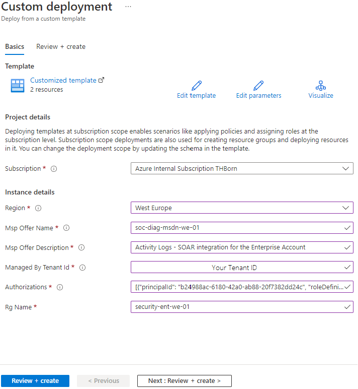
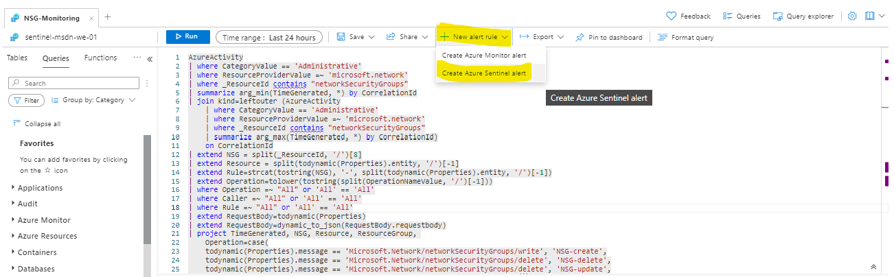

# Monitoring Network Security Group (NSG) changes 

## Multi Tenant Environment 

For the Security be able to use Microsoft Sentinel from another tenant we will use Azure Lighthouse. 

Via Azure Lighthouse we will be able to monitor Azure Activities from another tenant and few other things.

* Azure Lighthouse
* [Azure Subscrition Level](https://docs.microsoft.com/en-us/azure/role-based-access-control/elevate-access-global-admin)

## Azure Lighthouse on-boarding a customer

Go to the Azure Portal and login on the subscription you want to be managed. The so called "customer subscription".

We can read this titlle as on-boarding a **resource group** or a **subscription** to be managed by our tenant.
[Onboard a customer to Azure Lighthouse](https://docs.microsoft.com/en-us/azure/lighthouse/how-to/onboard-customer)

Here we will do the following steps:

1. Go to the Azure Portal and login to your customer's Tenant
2. [Go to the GitHub Repo](https://github.com/Azure/Azure-Lighthouse-samples/)
   * This will open an ARM Template we need to fill up
   * Pick one ARM template that matches with your decision and click on the blue sign "Deploy to Azure"
   * It could be a template to delegate a "resource group*, or **subcription**
   * We need now to decide the Role attached to the entity that will manage your Azure resources (user, or service principal)
3. [Get the ID from the bult-in Role](https://docs.microsoft.com/en-us/azure/role-based-access-control/built-in-roles)
4. Get your Tenant ID - The tenant that will manage the resources from the customer



5. The **Authorization** will need a to be an array composed by **principalId** and **roleDefinitionId** ID.

For instance this one is from an **user** from the tenant that will be managing the resource on the customer's Azure environment and the **roleDefinitionId** is **Contributor**.
```
[{ "principalId": "51e17a5b-e3c7-4f22-9401-8b6b49c8d03e",      "roleDefinitionId": "b24988ac-6180-42a0-ab88-20f7382dd24c","principalIdDisplayName": "SOC Team Service User"}]
```

## After the on-board from the Tenant that will manage

We will be able to see the delegated resources. And setup the Activity Logs to the central **Workspace** that a single Microsoft Sentinel will be able to monitor.

## Microsoft Sentinel and Alerts

The Kusto query to help us monitor. This query can be used to monitor deletion, updates and creations, including the stage of the action.

```kql
AzureActivity
| where CategoryValue == 'Administrative'
| where ResourceProviderValue =~ 'microsoft.network'
| where _ResourceId contains "networkSecurityGroups"
| summarize arg_min(TimeGenerated, *) by CorrelationId
| join kind=leftouter (AzureActivity
    | where CategoryValue == 'Administrative'
    | where ResourceProviderValue =~ 'microsoft.network'
    | where _ResourceId contains "networkSecurityGroups"
    | summarize arg_max(TimeGenerated, *) by CorrelationId)
    on CorrelationId
| extend NSG = split(_ResourceId, '/')[8]
| extend Resource = split(todynamic(Properties).entity, '/')[-1]
| extend Rule=strcat(tostring(NSG), '-', split(todynamic(Properties).entity, '/')[-1])
| extend Operation=tolower(tostring(split(OperationNameValue, '/')[-1]))
| where Operation =~ "All" or 'All' == 'All'
| where Caller =~ "All" or 'All' == 'All'
| where Rule =~ "All" or 'All' == 'All'
| extend RequestBody=todynamic(Properties)
| extend RequestBody=dynamic_to_json(RequestBody.requestbody)
| project TimeGenerated, NSG, Resource, ResourceGroup, 
    Operation=case(
    todynamic(Properties).message == 'Microsoft.Network/networkSecurityGroups/write', 'NSG-create',
    todynamic(Properties).message == 'Microsoft.Network/networkSecurityGroups/delete', 'NSG-delete',
    todynamic(Properties).message == 'Microsoft.Network/networkSecurityGroups/delete', 'NSG-update',
    RequestBody contains '{"properties":', 'Rule-create',
    strcat('Rule-', tolower(tostring(split(OperationNameValue, '/')[-1])))
    ),
    Caller, CallerIpAddress, 
    Message=todynamic(Properties).message, ActivityStatusValue,
    Result= ActivityStatusValue1,
    RequestBody,
    ResourceId=tolower(_ResourceId), 
    SourcePortRange = strcat(parse_json(RequestBody).properties.sourcePortRange, parse_json(RequestBody).properties.sourcePortRanges), 
    SourceAddressPrefix = strcat(parse_json(RequestBody).properties.sourceAddressPrefix, parse_json(RequestBody).properties.sourceAddressPrefixes),
    DestinationPortRange = strcat(parse_json(RequestBody).properties.destinationPortRange, parse_json(RequestBody).properties.destinationPortRanges), DestinationAddressPrefix = strcat(todynamic(RequestBody).properties.destinationAddressPrefix, todynamic(RequestBody).properties.destinationAddressPrefixes), 
    Access = parse_json(RequestBody).properties.access, 
    Priority = parse_json(RequestBody).properties.priority, 
    Direction = parse_json(RequestBody).properties.direction
| order by TimeGenerated desc
```

## Microsoft Sentinel response and remediation

1. Paste the query 



References: 
* [Built-in Roles and repective **IDs** list](https://docs.microsoft.com/en-us/azure/role-based-access-control/built-in-roles)
* [What my NSG is blocking](https://docs.microsoft.com/en-us/azure/virtual-network/virtual-network-nsg-manage-log)
* [Kusto and Json files ](https://docs.microsoft.com/en-us/azure/data-explorer/kusto/query/parsejsonfunction)
  


